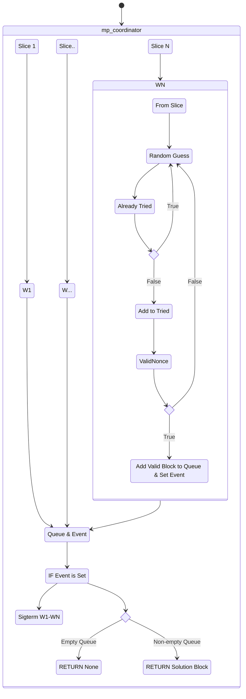

```mermaid
stateDiagram-v2

    mp_coordinator: mp_coordinator
    S1: Slice N
    S2: Slice 1
    S4: Slice..
    Q: Queue & Event
    Slice: From Slice
    Guess: Random Guess
    AT: Already Tried
    ATT: Add to Tried
    SE: Add Valid Block to Queue & Set Event
    RN: RETURN None
    RS: RETURN Solution Block
    E: IF Event is Set
    K: Sigterm W1-WN

    [*] --> mp_coordinator

    state mp_coordinator {
        S1 --> WN
        S2 --> W1
        S4 --> W...

        WN --> Q
        W1 --> Q
        W... --> Q

        Q --> E
        E --> K
        state if_state3 <<choice>>
        E --> if_state3
        if_state3 --> RN: Empty Queue 
        if_state3 --> RS: Non-empty Queue

    }

   

    state WN {
        Slice --> Guess

        
        state if_state <<choice>>
        Guess --> AT
        AT --> if_state
        if_state --> Guess: True
        if_state --> ATT : False

        ATT --> ValidNonce

        state if_state2 <<choice>>
        ValidNonce --> if_state2
        if_state2 --> SE: True
        if_state2 --> Guess: False
    }


    
```
